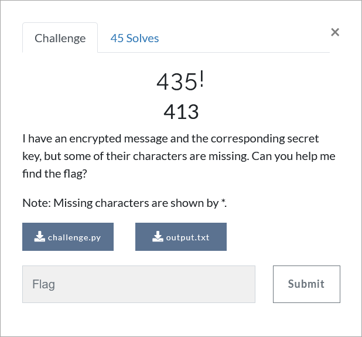

# Challenge Description
<p align="center">
  
</p>
<br>

# Writeup
Reviewing the code of this challenge, we find that a message is encrypted using the AES-CBC algorithm. Flag is the IV used to encrypt the first block and the key (except 3 bytes) is given.
Some bytes of the encrypted message is also given in the output file.

Since the last 21 bytes of the encrypted message are given (16 bytes for the last block and 5 bytes for the one before the last), the last block can be decrypted.
As we know, in the AES-CBC algorithm, the IV used to decrypt the last block is equal to the encrypted value of the previous block.
Since we only have 5 bytes of the block before the last, we set the first 11 bytes of the IV equal to zero.
In this way, we decode the last block using all possible values of the key, and by comparing the last 5 bytes of the decrypted value with the last 5 bytes of the clear text message, we obtain the key.
It should be noted that the last 5 bytes of the clear text message are equal to "\n\n\n\n\n" (to understand this, refer to the `pad` function).

After obtaining the key, we decrypt the last block using the obtained key. To do this, we set the IV to zero. Therefore, we obtain the encrypted value of the block before the last (which is also the IV used to encrypt the last block) by XORing the decrypted result with the last block of the clear text message.
By repeating this for the previous blocks, we finally get the flag, which is the IV of the first block. The solution code for this challenge is available in [solve.py](https://github.com/TMUCTF/TMUCTF-2021/blob/main/Crypto/435!/Writeup%20Files/solve.py).

The flag:
```
TMUCTF{Y0U_D3CrYP73D_17}
```
