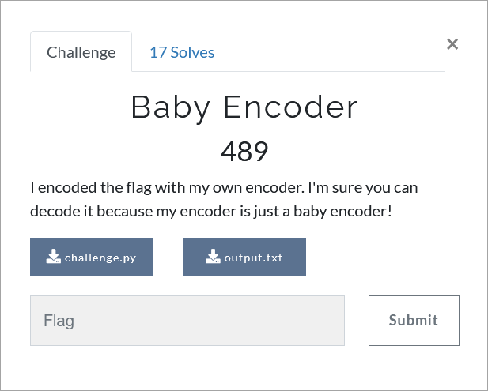

# Challenge Description

  

 

# Writeup
In this challenge, the flag is encoded in four steps and its final encoded value is given in the output file.
By decoding these four steps, we can access the flag. The solution code for this challenge is available in solve.py.
