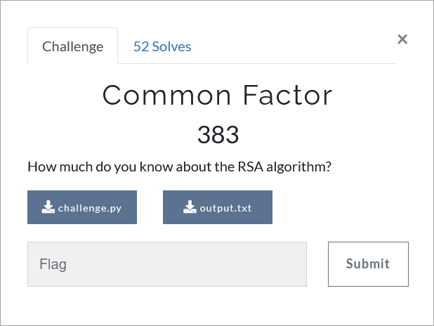

# Challenge Description
<p align="center">
  
</p>
<br>

# Writeup
This is an RSA challenge in which n is obtained by multiplying 5 prime factors. The values of n, e (public key) and encrypted flag are given.
In addition, we are given two other values, which are obtained by performing some mathematical operations on the three prime factors of n.
By analyzing the mathematical operations in the challenge code, one of the RSA factors can be found, as follows:
```
x1 = primes[1] ** 2
x2 = primes[2] ** 2
x3 = primes[1] * primes[2]

y1 = x1 * primes[2] + x2 * primes[1] = (primes[1] ** 2) * primes[2] + (primes[2] ** 2) * primes[1] = (primes[1] * primes[2]) * (primes[1] + primes[2])
y2 = x2 * (primes[3] + 1) - 1 = (primes[2] ** 2) * (primes[3] + 1) - 1
y3 = x3 * (primes[3] + 1) - 1 = (primes[1] * primes[2]) * (primes[3] + 1) - 1

z1 = x2 + x3 + y1 = (primes[2] ** 2) + (primes[1] * primes[2]) + (primes[1] * primes[2]) * (primes[1] + primes[2]) = (primes[2] ** 2) + (primes[1] * primes[2]) + (primes[1] ** 2 )* primes[2] + primes[1] * (primes[2] ** 2) = primes[2] * (primes[1] + primes[2]) * (primes[1] + 1)
z2 = y2 + y3 = (primes[2] ** 2) * (primes[3] + 1) - 1 + (primes[1] * primes[2]) * (primes[3] + 1) - 1 = primes[2] * (primes[2] * primes[3] + primes[2] + primes[1] * primes[3] + primes[1]) - 2 = primes[2] * (primes[1] + primes[2]) * (primes[1] + 1) - 2

g = gcd(z1, z2 + 2) = primes[2] * (primes[1] + primes[2])
g = gcd(g, n) = primes[2]
```
One of the tricks in the RSA algorithm is that if the plain text is smaller than the prime factors, it can be decrypted by having only one of them.
Fortunately, this trick works here as well, and it can be seen that the decryption result is equal to the flag.
The solution code for this challenge is available in solve.py.

The flag:
```
TMUCTF{Y35!!!__M4Y_N0t_4lW4y5_N33d_4ll_p21M3_f4c70R5}
```
