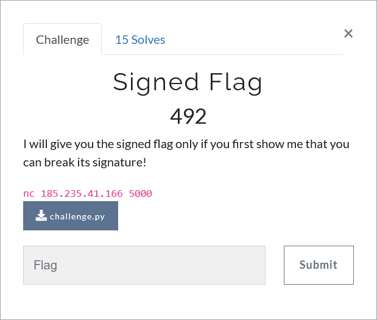

# Challenge Description
<p align="center">
  
</p>
<br>

# Writeup
In this challenge, the DSA digital signature algorithm is used to sign messages.
The point of this challenge is that the same keys are used to sign different messages, so the key (k) and the private key (d) values can be obtained as follows:
```
r = r1 = r2 = a^k % q

s1 = ((SHA1(msg1) + d * r) * invert(k, q)) % q
s2 = ((SHA1(msg2) + d * r) * invert(k, q)) % q

k * s1 = (SHA1(msg1) + d * r) % q
k * s2 = (SHA1(msg2) + d * r) % q
k (s2 - s1) = (SHA1(msg2) - SHA1(msg1)) % q
k = ((SHA1(msg2) - SHA1(msg1)) * invert((s2 - s1), q)) % q
d = ((s1 * k - SHA1(msg1)) * invert(r, q)) % q
```  
having the key, private key and message signature, the SHA1 of the secret message can be calculated as follows:
```
SHA1(secret) = (s3 * k - d * r) % q
```  
The solution code for this challenge is as follows (also available in [solve.py](https://github.com/TMUCTF/TMUCTF-2021/blob/main/Crypto/Signed%20Flag/Writeup%20Files/solve.py)):
```python
import pwn
from hashlib import sha1
from gmpy2 import xmpz, to_binary, invert, powmod, is_prime

rm = pwn.remote('185.235.41.166', 5000)
rm.recvlines(8)

for k in range(10):
	rm.recvlines(2)
	q = int(rm.recvline().strip().split()[2])
	rm.recvline()
	temp = rm.recvline().strip().split()
	msg1 = temp[0].decode().split("'")[1]
	s1 = int(temp[2])
	rm.recvline()
	temp = rm.recvline().strip().split()
	msg2 = temp[0].decode().split("'")[1]
	s2 = int(temp[2])
	rm.recvline()
	temp = rm.recvline().strip().split()
	s3 = int(temp[2])
	r = int(temp[3])
	rm.recvline()
	rm.recv()
	msg1 = str.encode(msg1, "ascii")
	msg2 = str.encode(msg2, "ascii")
	k = ((int(sha1(msg2).hexdigest(), 16) - int(sha1(msg1).hexdigest(), 16)) * invert(s2 - s1, q)) % q
	d = ((s1 * k - int(sha1(msg1).hexdigest(), 16)) * invert(r, q)) % q
	h = (s3 * k - d * r) % q
	rm.sendline(str(h))
	rm.recvline()
	secret = rm.recvline().strip().split()
	print(secret[5].decode(), "\n")

rm.close()
'''  
A sample output of this code is shown in the following figure.
<p align="center">
  
</p>

The flag:
```
TMUCTF{7h15_w45_my_m1574k3__1_f0r607_7h47_1_5h0uld_n3v3r_516n_mul71pl3_m3554635_w17h_4_dupl1c473_k3y!!!}
```
