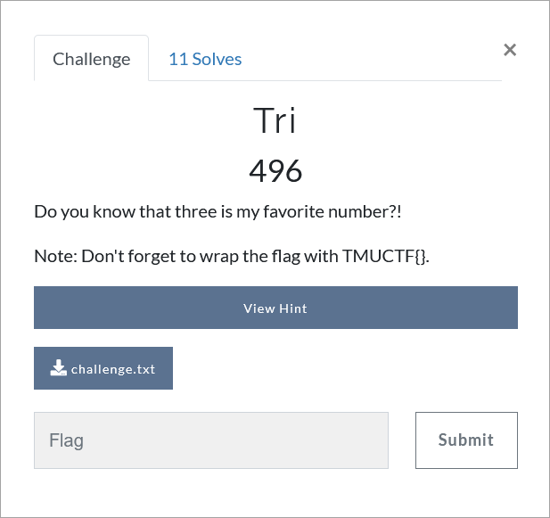

# Challenge Description
<p align="center">
  
</p>
<br>

# Writeup
First we use the Trifid cipher decoder. If you are not familiar with this cipher, it is enough that Google the challenge name along with the "cipher" word.
Based on the challenge description, we set the group size to 3.
<p align="center">
  
</p>

Then we separate the first part of the result, which is a meaningful sentence, and decode the second part with the Caesar cipher (again based on the challenge description we set the shift number to 3).
<p align="center">
  
</p>

Due to the meaningful part of the result and the challenge description the rest of the task is clear. Just the Rail Fence cipher with the key and the offset 3.
<p align="center">
  
</p>

The flag:
```
TMUCTF{classicciphersarealwaysinterestingisntthatso}
```
