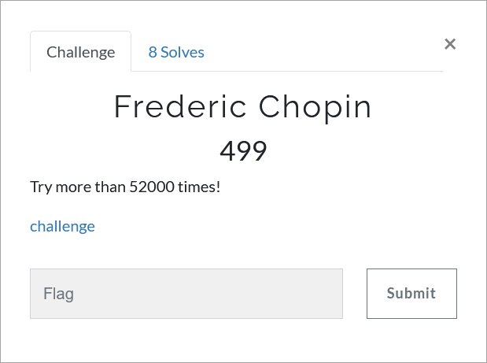

# Challenge Description
<p align="center">
  
</p>
<br>

# Writeup
In this challenge a wav file is given.
We should extract LSB bits of the wav file. `steglsb` is the most popular tool for wav LSB.
According to the description, we set the number of bytes to 52000:
```
stegolsb wavsteg -r -i Enjoy.wav -n 1 -b 52000 -o result
```
<p align="center">
  
</p>

The extracted file is a password protected RAR file.
Password is located at the end of the original wav file. It is Base64 encoded.
```
T29rLiBPb2suIE9vay4gT29rLiBPb2suIE9vay4gT29rLiBPb2suIE9vay4gT29rLiBPb2suIE9vay4gT29rLiBPb2suIE9vay4gT29rLiBPb2suIE9vay4gT29rLiBPb2suIE9vayEgT29rPyBPb2suIE9vaz8gT29rLiBPb2suIE9vay4gT29rPyBPb2suIE9vay4gT29rLiBPb2suIE9vay4gT29rLiBPb2suIE9vaz8gT29rLiBPb2suIE9vay4gT29rLiBPb2suIE9vay4gT29rLiBPb2suIE9vay4gT29rLiBPb2suIE9vay4gT29rLiBPb2suIE9vay4gT29rPyBPb2suIE9vay4gT29rLiBPb2suIE9vay4gT29rLiBPb2suIE9vay4gT29rLiBPb2suIE9vay4gT29rLiBPb2suIE9vay4gT29rLiBPb2suIE9vay4gT29rLiBPb2suIE9vay4gT29rPyBPb2suIE9vaz8gT29rLiBPb2s/IE9vay4gT29rPyBPb2suIE9vayEgT29rISBPb2s/IE9vayEgT29rLiBPb2s/IE9vay4gT29rPyBPb2suIE9vaz8gT29rLiBPb2s/IE9vay4gT29rLiBPb2suIE9vay4gT29rLiBPb2suIE9vay4gT29rLiBPb2suIE9vay4gT29rLiBPb2suIE9vay4gT29rLiBPb2suIE9vay4gT29rLiBPb2suIE9vay4gT29rLiBPb2suIE9vay4gT29rLiBPb2suIE9vayEgT29rLiBPb2s/IE9vay4gT29rISBPb2shIE9vayEgT29rISBPb2shIE9vayEgT29rISBPb2shIE9vayEgT29rLiBPb2suIE9vaz8gT29rLiBPb2suIE9vay4gT29rLiBPb2suIE9vay4gT29rLiBPb2suIE9vay4gT29rLiBPb2suIE9vay4gT29rLiBPb2suIE9vayEgT29rLiBPb2shIE9vayEgT29rISBPb2shIE9vayEgT29rISBPb2shIE9vayEgT29rISBPb2shIE9vayEgT29rISBPb2shIE9vayEgT29rISBPb2suIE9vaz8gT29rLiBPb2suIE9vay4gT29rLiBPb2suIE9vay4gT29rLiBPb2suIE9vay4gT29rLiBPb2suIE9vay4gT29rLiBPb2suIE9vay4gT29rLiBPb2suIE9vay4gT29rLiBPb2suIE9vay4gT29rLiBPb2suIE9vay4gT29rLiBPb2suIE9vay4gT29rLiBPb2suIE9vay4gT29rLiBPb2suIE9vay4gT29rLiBPb2suIE9vay4gT29rLiBPb2suIE9vay4gT29rLiBPb2suIE9vay4gT29rLiBPb2shIE9vay4gT29rISBPb2shIE9vayEgT29rISBPb2shIE9vayEgT29rISBPb2shIE9vayEgT29rLiBPb2suIE9vay4gT29rLiBPb2suIE9vay4gT29rLiBPb2suIE9vay4gT29rLiBPb2suIE9vay4gT29rLiBPb2shIE9vay4gT29rPyBPb2suIE9vay4gT29rLiBPb2suIE9vay4gT29rLiBPb2suIE9vay4gT29rLiBPb2suIE9vay4gT29rLiBPb2suIE9vay4gT29rLiBPb2suIE9vay4gT29rLiBPb2suIE9vay4gT29rLiBPb2suIE9vay4gT29rLiBPb2suIE9vay4gT29rLiBPb2suIE9vay4gT29rLiBPb2suIE9vay4gT29rLiBPb2suIE9vay4gT29rLiBPb2suIE9vay4gT29rLiBPb2suIE9vay4gT29rLiBPb2suIE9vayEgT29rLiBPb2suIE9vaz8gT29rISBPb2shIE9vayEgT29rLiBPb2suIE9vaz8gT29rLiBPb2suIE9vay4gT29rLiBPb2suIE9vay4gT29rLiBPb2suIE9vay4gT29rLiBPb2suIE9vay4gT29rISBPb2su
```  
After decoding we obtain a string in Ook! Language:
```
Ook. Ook. Ook. Ook. Ook. Ook. Ook. Ook. Ook. Ook. Ook. Ook. Ook. Ook. Ook. Ook. Ook. Ook. Ook. Ook. Ook! Ook? Ook. Ook? Ook. Ook. Ook. Ook? Ook. Ook. Ook. Ook. Ook. Ook. Ook. Ook? Ook. Ook. Ook. Ook. Ook. Ook. Ook. Ook. Ook. Ook. Ook. Ook. Ook. Ook. Ook. Ook? Ook. Ook. Ook. Ook. Ook. Ook. Ook. Ook. Ook. Ook. Ook. Ook. Ook. Ook. Ook. Ook. Ook. Ook. Ook. Ook. Ook? Ook. Ook? Ook. Ook? Ook. Ook? Ook. Ook! Ook! Ook? Ook! Ook. Ook? Ook. Ook? Ook. Ook? Ook. Ook? Ook. Ook. Ook. Ook. Ook. Ook. Ook. Ook. Ook. Ook. Ook. Ook. Ook. Ook. Ook. Ook. Ook. Ook. Ook. Ook. Ook. Ook. Ook. Ook. Ook! Ook. Ook? Ook. Ook! Ook! Ook! Ook! Ook! Ook! Ook! Ook! Ook! Ook. Ook. Ook? Ook. Ook. Ook. Ook. Ook. Ook. Ook. Ook. Ook. Ook. Ook. Ook. Ook. Ook. Ook! Ook. Ook! Ook! Ook! Ook! Ook! Ook! Ook! Ook! Ook! Ook! Ook! Ook! Ook! Ook! Ook! Ook. Ook? Ook. Ook. Ook. Ook. Ook. Ook. Ook. Ook. Ook. Ook. Ook. Ook. Ook. Ook. Ook. Ook. Ook. Ook. Ook. Ook. Ook. Ook. Ook. Ook. Ook. Ook. Ook. Ook. Ook. Ook. Ook. Ook. Ook. Ook. Ook. Ook. Ook. Ook. Ook. Ook. Ook. Ook. Ook. Ook! Ook. Ook! Ook! Ook! Ook! Ook! Ook! Ook! Ook! Ook! Ook. Ook. Ook. Ook. Ook. Ook. Ook. Ook. Ook. Ook. Ook. Ook. Ook. Ook! Ook. Ook? Ook. Ook. Ook. Ook. Ook. Ook. Ook. Ook. Ook. Ook. Ook. Ook. Ook. Ook. Ook. Ook. Ook. Ook. Ook. Ook. Ook. Ook. Ook. Ook. Ook. Ook. Ook. Ook. Ook. Ook. Ook. Ook. Ook. Ook. Ook. Ook. Ook. Ook. Ook. Ook. Ook. Ook. Ook. Ook! Ook. Ook. Ook? Ook! Ook! Ook! Ook. Ook. Ook? Ook. Ook. Ook. Ook. Ook. Ook. Ook. Ook. Ook. Ook. Ook. Ook. Ook! Ook.
```  
After decoding this string we get the password: `pBwpWSY3Xv`. So we can open the RAR file and get an image that contains the flag.
<p align="center">
  
</p>

The flag:
```
TMUCTF{cH0P1n_M@ZURkA_In_f_m1NOr_oP68_No4}
```
