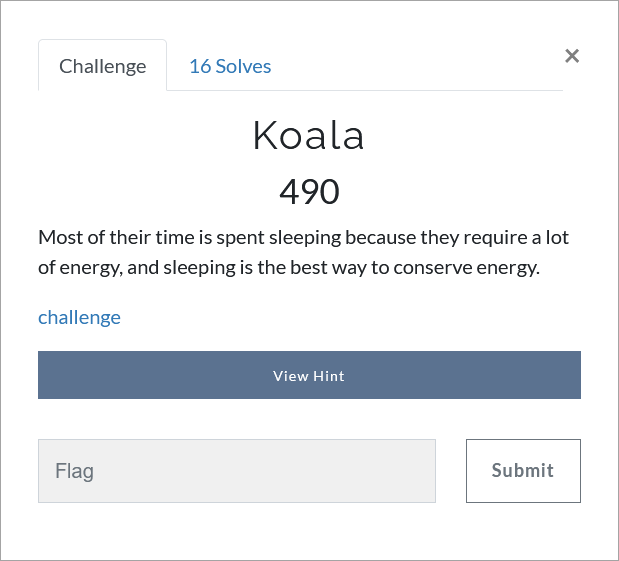

# Challenge Description
<p align="center">
  
</p>
<br>

# Hint
The flag has two parts.

# Writeup
The given file is a disk image so we should mount it. There is a html file inside the disk image:
```
file:///F:/I'm%20hidden/Downloads/you%20are%20the%20best%20animal.htm
```  
The content of this web page is a image and a link is embedded in the alt tag of this image.
Given that the image is a Mega page, we should open this link in Mega.  
[https://mega.nz/file/1xw0yIwY#CeOkxHwdYcrmmcLU-UsBusLzBgmRFTiewgcXsjwPC4g](https://mega.nz/file/1xw0yIwY#CeOkxHwdYcrmmcLU-UsBusLzBgmRFTiewgcXsjwPC4g)

There is an article in this link and a part of the flag is hidden in it.
<p align="center">
  
</p>

Also there is a Koala image in the disk image with the name [hi.jpg](https://github.com/TMUCTF/TMUCTF-2021/blob/main/Forensics/Koala/Writeup%20Files/Hi.jpg).
<p align="center">
  
</p>

Furthermore, there is a text file, namely, "Don't touch me.txt", in the Documents folder, which contains an interesting sentence
<p align="center">
  
</p>

By some Googling, we find the following steganography tool.
[https://futureboy.us/stegano](https://futureboy.us/stegano)

We try this tool on the Koala image, without any password, and we get the second part of the flag.
<p align="center">
  
</p>

The flag:
```
TMUCTF{URN5CBDGRu1pFvglq2y6}
```
