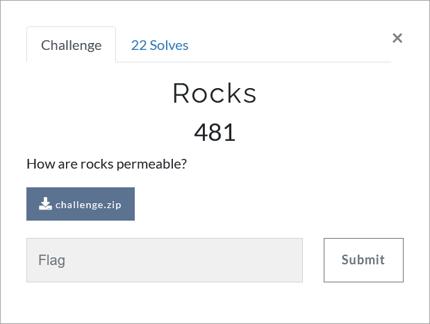

# Challenge Description
<p align="center">
  
</p>
<br>

# Writeup
In this challenge a zip file is given. After extracting the zip file, two images are obtained.
Using `binwalk –e Sandstone.jpg` command, a new zip file can be accessed, which has a password.
The file's password can be found using the `exiftools Sandstone.jpg` command ,in the `Copyright Notice` section.
'''
4MRXmZyIVNBp
'''  
After extracting the zip file, two files are obtained.
Open the `4y3` file with the nano editor and see that there are spaces and tabs at the end of its lines.
Therefore, we guess that some information is hidden in this file using the `stegsnow` tool.
Use the stegsnow tool, with this command: `stegsnow -C  4y3`.
The second part of the flag is obtained:
```
ll3r_7h4n_R0ck}
```
Using the `file` command, we notice that the next file is an Excel file.
The Excel file contains macro. By executing the macro code, no new information will be obtained.
One of the open-source tools I found handy for extracting embedded macros from Microsoft Office documents is `Oletools`. Oletools is a collection of Python tools.
`olevba` can detect VBA macros.
There is a condition in the code that is based on the calculated distance. The `Else` part will never occur because the distance is always a non-negative value.
The phrase in the `Else` part gives us a guide:
```
Stegano is a pure python steganography module,…
```
Google for the `Stegano` tool and finally the following command gives us the first part of the flag.
```
stegano-red reveal -i Mudstone.png
```  
```
TMUCTF{570n3_15_5m4
```  
### Note:
If we use the `zsteg` tool on `Mudstones.png` (the following command), we can also get the first part of the flag.
```
zsteg --all Mudstones.png | grep -i tmuctf
```
The flag:
```
TMUCTF{570n3_15_5m4ll3r_7h4n_R0ck}
```
