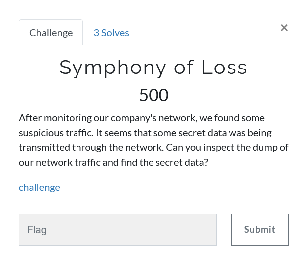

# Challenge Description
<p align="center">
  
</p>
<br>

# Writeup
Use wireshark to view pcap file.
```
Export objects => Http => Sort by size => Export oasjnrfou32r01230.zip
```
The zip file requires password. Password is in the packet no. 22482 (Found via searching for phrase "pass").
Inspect http objects. There is an audio file => @ 1:18.
It seems there is something embedded. Open the audio file using `Sonic Visualizer`.
We find the string `TMUCTF{1Mp0rTAnt_bUt_n0T_FLaG}` in the spectogram.
We use `binwalk --dd=".*" file_name` command to extract all information from the audio file.
Album art is what we are looking for. 
We use `steghide extract -sf file_name -p "TMUCTF{1Mp0rTAnt_bUt_n0T_FLaG}"` command to get the flag.

The flag:
```
TMUCTF{7h3r3_4r3_50_M4ny_7h1n65_H1dd3n_D33p_1n51d3}
```
