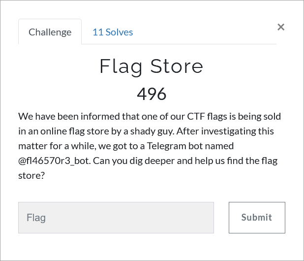

# Challenge Description
<p align="center">
  
</p>
<br>

# Writeup
This challenge is a misc challenge containing dark web, blockchain and reversing. 
First we visit the telegram bot and after invoking `/dogpic` command three times, we get a picture of a dog with a QR code on the bottom left.
Scanning the QR code we will be redirected to an onion website: [http://zlmwylekzyxcqjfwaga4xrtuoiwvj7qrh7ctb4o6i3bf6zoygoj5znyd.onion/](http://zlmwylekzyxcqjfwaga4xrtuoiwvj7qrh7ctb4o6i3bf6zoygoj5znyd.onion/). 
The website says that a flag of the TMUCTF is up for sale. There is an ethereum address to transfer the money using ethers.
We use etherscan to analyze the address:
```
https://etherscan.io/address/0x683F48F5056AD6fAF3c5ce9aC46314D967d4ab34#analytics
```  
There is nothing on the mainnet. Because it is a ctf challenge we also analyze ropsten testnet:
```
https://ropsten.etherscan.io/address/0x683F48F5056AD6fAF3c5ce9aC46314D967d4ab34
```  
Here in the transaction, we see an outgoing transaction which creates a smart contract:
```
https://ropsten.etherscan.io/address/0xb89234121e910adb83a630af1a196abb3f672010
```
In the contract page inside the contract tab, we can see that the source code is disclosed:
```
/**
 *Submitted for verification at Etherscan.io on 2021-09-05
*/

pragma solidity 0.5.1;

//fl465734l3r


contract CTF {
    
    bytes x;
    bytes y;
    bytes z;
    bytes w;
    address owner;
    
    
    constructor() public {
        owner = msg.sender;
    }
    
    function encoder(string memory str) public returns (bytes memory) {
        require(msg.sender == owner);
        
        bytes memory flag = bytes(str);
        for (uint256 i = 0; i < flag.length; i++) {
            if (i < 1) {
                x.push(flag[i]);
            } else {
                x.push(flag[i] ^ flag[i - 1]);
            }
        }

        for (uint256 i = 0; i < flag.length; i++) {
            if (i < 1) {
                y.push(x[i]);
            } else {
                y.push(
                    x[i] ^ x[i - 1]
                );
            }
        }

        for (uint256 i = 0; i < flag.length; i++) {
            z.push(y[i] ^ 0xff);
        }
        for (uint256 i = 0; i < flag.length; i++) {
            w.push(z[flag.length - i - 1]);
        }

        return w;
    }

    function decoder() public pure returns (string memory) {
        return "Develop it";
    }

    function encoded_flag() public pure returns (string memory) {
        return "0xeab1e5f8faf8bdbdb8bdd2ff908690849195ac93ca93c3d2a0c994d690e089d28c96fea58dcc8fcef8e8bbc4f1fbd0fafef1feb2ab";
    }

    function about() public pure returns (string memory) {
        return "Develop a decoder to get the flag";
    }
}
```  
The code is consisted of a simple encoder which all it does is reversing bytes and other stuff. Also there is a function that only returns the encoded flag. 
Putting them together by a simple reversing act, we will be able to get the flag.

The flag:
```
TMUCTF{Buy1n6_Fl465_Fr0m_D4rk_W3b_15_N07_7ru57w0r7hy}
```
