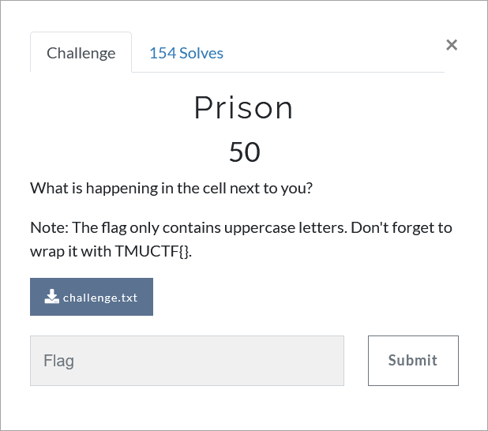

# Challenge Description
<p align="center">
  
</p>
<br>

# Writeup
We are given a file containing some dots:
```
.... .... .. ... . ..... ... ..... .... .. .. .... .... ... ... .... ... ... . ..... .... .. .. .... .... ... .... .... .... .. ..... .... .. .... ... ... .. .. .... .... ... .... . ..... .... ... . ... . . ... ..... . ..... .. . .... .. ... .... ... .. .. ... .. .... .... ... . ... . ..... ... . ... . 
```
This is Tap (Knock) Code. Just look for online decoders and decode it! Here is the decoding result:  
```
THEPRISONERISTRYINGTOESCAPEFROMHISCELL
```
The flag:  
```
TMUCTF{THEPRISONERISTRYINGTOESCAPEFROMHISCELL}
```
