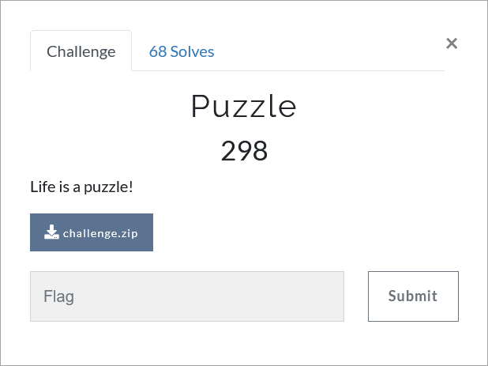

# Challenge Description
<p align="center">
  
</p>
<br>

# Writeup
In this challenge you are given an image. This image is a picture of **Mohammad-Reza Shajarian**. He was an Iranian singer and master of Persian traditional music.
The first thing that comes to mind is to check if a file is hidden inside this image.
Use Binwalk for this purpose and see that a zip file is hidden inside the image.
Extract the zip file. Inside the zip file there is an image of a puzzle and another zip file with a password.
To get the password we have to solve the puzzle.
<p align="center">
  
</p>

Carefully in the puzzle we find that each of its lines (except the first one) describes the previous line, 
so that in each line the first digit represents the previous line number and then the digits of the previous line are counted. 
For example, since in the third line the number 2 is repeated 2 times, the number 4 is repeated 1 times, and the number 1 is repeated 2 times, the forth line is equal to `3221421`.
In this way, the value of the final line, which is the password of the file, is equal to `61542142311`.

Extract flag.txt and see that there is a Base64 encoded string inside it.
```
R1pIUEdTe1EzeV9NM19RNDU3NHpfRTRzNzBfVzRhX1U0el9PMV9RM3kwX1c0YV9QdTAwYV9YMGE0en0=
```  
After Base64 decoding we have:
```
GZHPGS{Q3y_M3_Q4574z_E4s70_W4a_U4z_O1_Q3y0_W4a_Pu00a_X0a4z}
```  
Finally ROT13 decoding give us the flag.

The flag:
```
TMUCTF{D3l_Z3_D4574m_R4f70_J4n_H4m_B1_D3l0_J4n_Ch00n_K0n4m}
```
