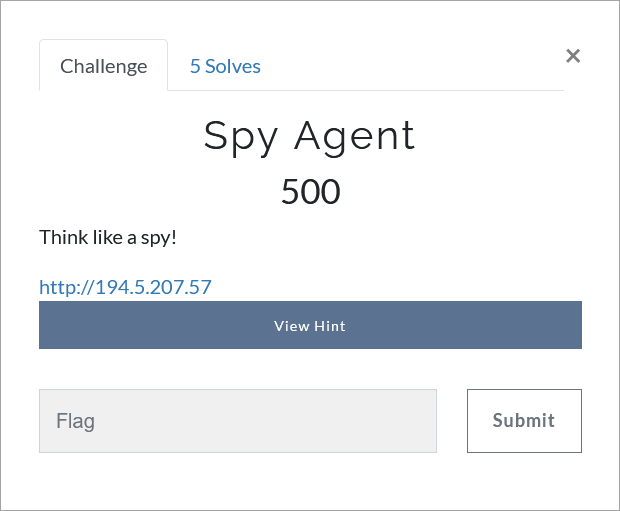

# Challenge Description
<p align="center">
  
</p>
<br>

# Hint
The spy has hidden his password somewhere. The password only contains lowercase letters and numbers.

# Writeup
In this challenge the address of a website is given. In the source code of the about.html page, the following phrase is found, which is obviously a Base64 string:
```
aHR0cHM6Ly9tZWdhLm56L2ZpbGUvUTVaR1dMNWEjcW04Y20tV2ZVVVZMbGUyaTA2ZVJITkc0eFRwNjlRY0tJV0JaUmtGSFktVQ==
```  
By Base64 decoding we obtain the following mega link:  
[https://mega.nz/file/Q5ZGWL5a#qm8cm-WfUUVLle2i06eRHNG4xTp69QcKIWBZRkFHY-U](https://mega.nz/file/Q5ZGWL5a#qm8cm-WfUUVLle2i06eRHNG4xTp69QcKIWBZRkFHY-U)

We download the image placed in this link. 
Using Binwalk, a zip file is obtained, which contains a pdf file.
Open the pdf file with Word. A collection of images can be seenBehind the first image at the beginning of the file. 
(You can also use the pdfimages command to get images from a pdf file.) 
These images are a demonstration of the Hexahue cipher. By encoding we obtain: `14mp455w0rd`
According to the hint, this seems to be a password.

One of the most popular tools that can be used to hide and extract information from the images is Steghide, which requires a password to extract data.
Using this tool and the password obtained, we can access the flag file.
```
steghide extract -sf imitation-game.jpg
```  
The flag:
```
TMUCTF{C41rncr055_15_4_50v137_5py!}
```
