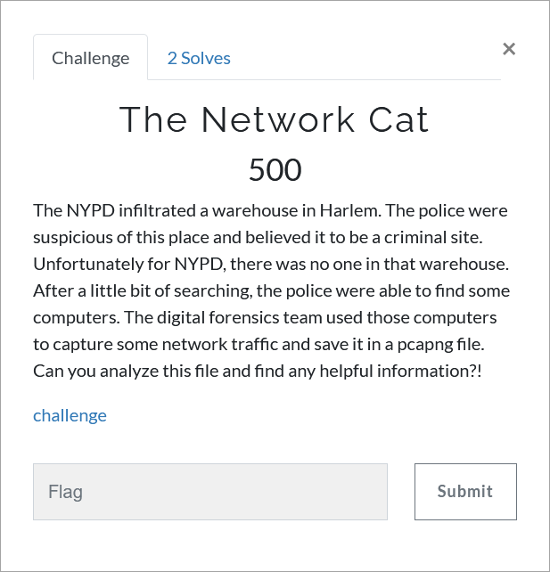

# Challenge Description
<p align="center">
  
</p>
<br>

# Writeup
Use wireshark to view the pcap file. 
We need to dig into the conversations. 
There is an important conversation between Luca and Don. 
Using GTP Protocol we can narrow down the results, but it's best to follow packets by their number. 
First message of the conversation can be found in the packet no. 11246. 
By observing the conversations, an IP can be found. 
Also we find out that "Don" uses his son's fullname as a key to his important files. 
Also using a little bit of OSINT or if we just watched "The Godfather" we can understand that "Don" is Actually Don Corleone. 
Connecting to IP address using netcat, we find out that we need to provide a key to get the flag. 
Don Corleone's sons fullnames don't work, so we need to dig deeper. 
In http objects, we can find a zip file. 
It is password protected, we try the sons fullnames and "michaelcorleone" works. 
There are two files inside, an ELF and a dll. 
The program won't run, but through the errors we find out that it is a .NET program, so let's open it with DotNetSpy (dnSpy). 
Openning the dll using dnSpy shows that it's a replica of the server. 
Now we should read the code so we can find out what the key can be. 
`TTFF9191919194ES` is a valid key, by submitting it, we will get the flag.

The flag:
```
TMUCTF{D0n_C0rl30n3_V3r5u5_7h3_N37_C47}
```
