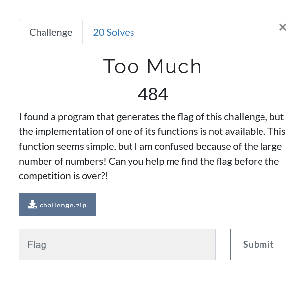

# Challenge Description
<p align="center">
  
</p>
<br>

# Writeup
In this challenge, the file "numbers.txt" is given, which is containing 1000000 numbers. 
to get the flag of this challenge, a function must be written that, `given a number x, returns the number of distinct pairs (y, z) from the numbers in the file "numbers.txt" whose y != z and (y + z) == x`.
It should be noted that two pairs (y, z) and (z, y) are considered the same and are counted only once.
Because the number of numbers in the file "numbers.txt" is large, the straight forward method that compares all pairs of the numbers together cannot be used
(this straight forward method has a high time complexity and requires a lot of time to run).
To solve the challenge, it is necessary to use an algorithm with less time complexity.
A sample of such an algorithm that can find the flag in a short time is as follows (Also available in [solve.py](https://github.com/TMUCTF/TMUCTF-2021/blob/main/Misc/Too%20Much/Writeup%20Files/solve.py)):
```python
def func(x):
    f = open('Numbers.txt', 'r')
    arr1 = []
    for i in range(1000000):
	    num = f.readline()
	    arr1.append(int(num))
    f.close()
    arr1 = list(dict.fromkeys(arr1))
    arr2 = [(x - y) for y in arr1]
    arr3 = arr1 + arr2
    n1 = len(arr3)
    arr3 = list(dict.fromkeys(arr3))
    n2 = len(arr3)
    return((n1 - n2) // 2)

	
def get_flag(res):
    flag = []
    for i in range(len(res)):
        flag.append(chr(func(res[i])))
    flag = ''.join(flag)
    return flag


if __name__ == "__main__":
    res = [751741232, 519127658, 583555720, 3491231752, 3333111256, 481365731, 982100628, 1001121327, 3520999746,
           915725624, 3218509573, 3621224627, 3270950626, 3321456817, 3091205444, 999888800, 475855017, 448213157,
           3222412857, 820711846, 3710211491, 3119823672, 3333211607, 812955676, 971211391, 3210953872, 289789909,
           781213400, 578265122, 910021887, 653886578, 3712776506, 229812345, 582319118, 1111276998, 1151016390,
           700123328, 1074521304, 3210438183, 817210125, 501231350, 753244584, 3240911853, 415234677, 469125436,
           592610671, 612980665, 291821367, 344199617, 1011100412, 681623864, 897219249, 3132267885, 565913000,
           301203203, 3100544737, 432812663, 1012813485, 510928797, 671553831, 3216409218, 3191288433, 698777123,
           3512778698, 810476845, 3102989588, 3621432709, 812321695, 526486561, 378912454, 3316207359, 623111580,
           344209171, 537454826, 691277475, 2634678623, 1112182335, 792111856, 762989676, 666210267, 871278369,
           581009345, 391231132, 921732469, 717217468, 3101412929, 3101217354, 831912337, 532666530, 701012510,
           601365919, 492699680, 2843119525]
    print("The flag is", get_flag(res))
```  
The flag:
```
TMUCTF{r4nd0m_fl46_f0r_fun!_SzC!$JvnbrRh6kc*1@L!4vMueH1k0xKPJem@vh6Y2&Sb2CJzwjnTfU6wVZyePOK3}
```
