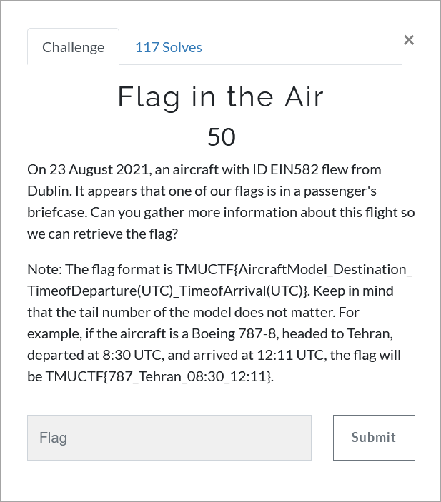

# Challenge Description
<p align="center">
  
</p>
<br>

# Writeup
You are provided with the plane ID so you only need to look for a reliable flight tracking website. Here is a good free website:
[https://www.flightera.net/en/flight_details/Aer+Lingus-Dublin-Malaga/EI582/EIDW/2021-08-23](https://www.flightera.net/en/flight_details/Aer+Lingus-Dublin-Malaga/EI582/EIDW/2021-08-23)

After that you only need to convert times to UTC. You must just pay attention that IST is Irish Standard Time, not India Standard Time. It is both mentioned
on the website and obvious regarding to the flight.

The flag:
```
TMUCTF{A330_Malaga_06:43_09:25}
```
