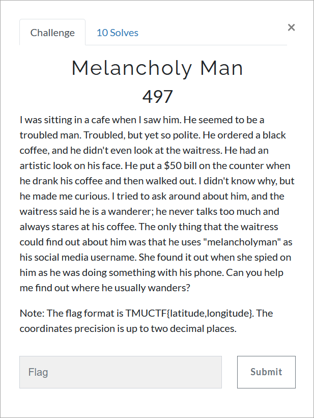

# Challenge Description
<p align="center">
  
</p>
<br>

# Writeup
This challenge is probably the hardest OSINT challenge of the CTF. But I'll try to give you the solution in the simplest way possible.

First you must search for the username "melancholyman" in social media tools. [https://instantusername.com/](https://instantusername.com/) is good enough.
You can see tons of social medias but only a handful of them has been occupied.
In the description it has been mentioned that he had an artistic look. This will help you to narrow down the results.
The answer here is crevado and you need to get to [https://melancholyman.crevado.com/](https://melancholyman.crevado.com/).
In about, The melancholy man says that he has something to share with you and leads you to [https://www.my-diary.org/read/e/546279085/Poems](https://www.my-diary.org/read/e/546279085/Poems).
The poems are very beautiful but there are not what you are looking for. You must read the other writing of this user "A Love Lost":
[https://www.my-diary.org/read/e/546279082/a-love-lost](https://www.my-diary.org/read/e/546279082/a-love-lost).
In the writing there is one line that is strongly connected to the challenge description:
```
And I always wander, I always look for you on the place the song mentions.
```
and the song refers to a previous line:
```
I still listen to the song from the night we met, "Sovereign Light Café".
```
It is a song by Keane. So you must look for a place mentioned in the song.
Let's search for the lyrics. The lyrics mentions a lot of places, but it has a part connected to the writing:
```
I wheel my bike off the train
Up the North Trade Road
Look for you on Marley Lane
```
So you can understand that the place is Marley Lane. Let's Google it.
You can find it on google map but there is also a more accurate results: [https://www.keanetrail.org.uk/marley-lane/](https://www.keanetrail.org.uk/marley-lane/).
it is a website devoted to Keane and their songs. In that web page there is a post code: ```TN33 0RE```.
Googling the post code gives you the precise location, eventhough you only need to have it up to two decimal places.

The flag:
```
TMUCTF{50.92,0.51}
```
