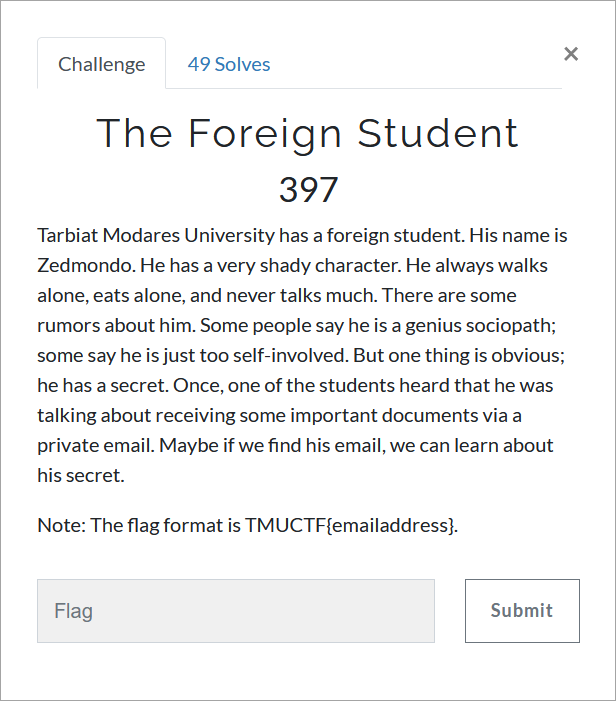

# Challenge Description
<p align="center">
  
</p>
<br>

# Writeup
First you need to search for Zedmondo + Tarbiat Modares University. It will result in a linkedin account: [https://www.linkedin.com/in/zedmondo-zaberini-203b33206/](https://www.linkedin.com/in/zedmondo-zaberini-203b33206/).
Although viewing the profile we can be sure that he is who we are looking for, there is nothing there but a github link: [https://github.com/ZedZini](https://github.com/ZedZini).
There are some forked repositories there and some created by himself. You must observe them carefully. But the flag is in the public key file with the interesting readme.
Opening it with Kleopatra or any other tools will lead to finding the secret email.

The flag:
```
TMUCTF{Z3dm0nd0_Z4b3r1n5k1_15_My_R34l_N4m3@zaberini.com}
```
