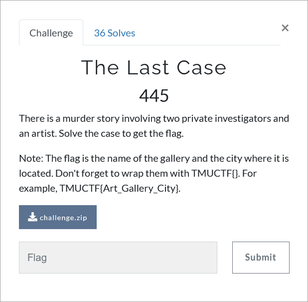

# Challenge Description
<p align="center">
  
</p>
<br>

# Writeup
Well it is a classic murder story.
After reading the story and the letter, you will find out that the nearest possible location of the sculpture is TMOCA, Tehran Museim of Contemporary Arts.
The photograph is related to an artist there. Finding it in the google photos of the museum will result in Tony Cragg as the artist.
Searching for him in the google will lead to his personal website.
In the publication page [https://www.tony-cragg.com/publications/](https://www.tony-cragg.com/publications/) you can find the place where he published his last work which is Lisson Gallery, London. 

The flag:
```
TMUCTF{Lisson_Gallery_London}
```
