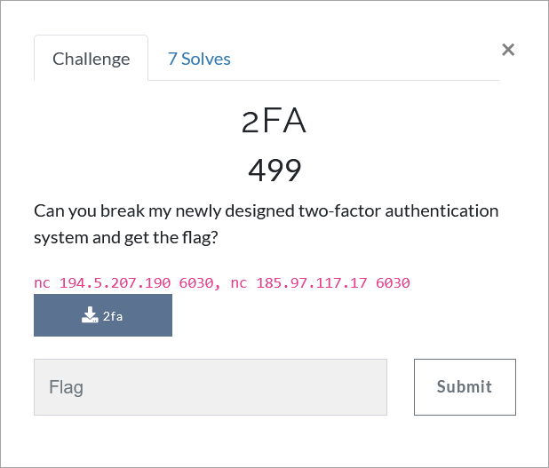

# Challenge Description
<p align="center">
  
</p>
<br>

# Writeup
In this challenge a 64-bit ELF file is given. Run the file and see that it first asks us for a key. Decompile the file with Ghidra or IDA Pro.  
By analyzing the code, we find that this is a two-factor authentication program that first takes the key and then, if the key is correct, takes the password from the user. 
If the password is also correct, we must enter a secret correctly and get the flag.  
A closer look at the program reveals that the key entered by the user is compared to the main key in the `verify` function. 
Carefully in the `verify` function we see that the user key and the main key characters are compared one by one in a loop and as soon as the first incorrect character is reached, an error message is printed. 
Due to the fact that there is a one-second `sleep` call in each round of the loop, it is possible to determine whether the entered key characters are correct or incorrect by calculating the time that the error message is printed. 
This type of timing attacks is called `side channel` attacks. 
The solution code for this part of the challenge is as follows (also available in [solve_part1.py](https://github.com/TMUCTF/TMUCTF-2021/blob/main/Reversing/2FA/Writeup%20Files/solve_part1.py)):
```python
import pwn
import time

k = 0
final_key = []
key = ''
while(k < 8):
	pre_key = key
	for i in range(32, 127):
		key += chr(i)
		r = pwn.remote('194.5.207.190', 6030)
		r.recvlines(17)
		r.recv()
		start = time.time()
		r.sendline(key)
		r.recvlines(1)
		end = time.time()
		delay = end - start
		print(delay)
		if (delay >= k + 1):
			final_key.append(chr(i))
			break
		else:
			key = pre_key
	k += 1

print(''.join(final_key))
```
The key is:
```
G7yTu83M
```  
After entering the correct key, we must enter the password. Carefully in the code we see that the password is evaluated in the `factor2` function. 
The `factor2` function generates a number of random numbers. 
Since the value of `seed` is fixed and obtained from the key (we have the key in this step), so, by fixing seed, we can get random numbers and simply invert the function and obtain the password. The solution code for this part of the challenge is as follows (also available in [solve_part2.c](https://github.com/TMUCTF/TMUCTF-2021/blob/main/Reversing/2FA/Writeup%20Files/solve_part2.c)).
```c
#include <stdio.h>

static int state;

srand(seed) { 
    state = seed; 
  } 

rand() { 
    state = (state * 214013 + 2531011) & 0xFFFFFFFF; 
    return (state >> 16) & 0x7FFF; 
}

void main() {
    int n = 0;
    int var1, var2;
    int diff[6] = {895425380, 1848642222, 877650015, 813089424, 945746850, 926285019};
    char *ukey = "G7yTu83M";
    int *y = (int *)(ukey);
    srand(*y + 3 + *(y + 1) * 2);
    for (int i = 0; i <= 5; i++) {
        var2 = rand();
        printf("%x\n", var2 + diff[i]);
    }
}
```
The password is:
```
50_57R0nG_P455w02d_83467
```  
In the third part of the challenge, we must enter a secret message to get the flag. To see how this part is solved, refer to the [Collision](https://github.com/TMUCTF/TMUCTF-2021/blob/main/Reversing/Collision) challenge.

The flag:
```
TMUCTF{4r3_y0u_f4m1l14r_w17h_5p4c3_71m3_vuln3r4b1l17135_1nclud1n6_51d3_ch4nn3l_4nd_4l60r17hm1c_c0mpl3x17y?!?}
```
