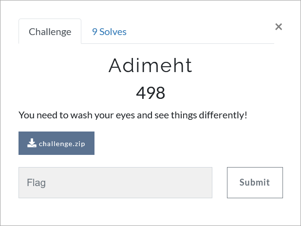

# Challenge Description
<p align="center">
  
</p>
<br>

# Writeup
We are given an `exe` file in this challenge. There is a hint in its name. If you read it from right, you see `themida` word.
It is a packing tool and it is hard to unpack files that are packed with themida!
There is just one case that we can unpack a packed program that is packed with it.
If the program is written in `.NET` there is some tools that dump unpacked program from memory while the program is running.   
Now let's see this executable file. if you look at its sections, you will see a `.themida` section which makes us sure that this program is packed with themida.    
I used `die.exe`:    
<p align="center">
  
</p>  

`ExtremeDumper` is one of the tools that can be used for unpacking themida-packed .NET files.
It gets a dump from the unpacked file loaded to memory and stores it.
In order to get a dump from a unpacked exe file, first run the exe file and while it is running, run ExtremeDumper.
It lists all executables running in the system. Right-click on it and select dump. This is how you can get the unpacked exe file.   
Finally use dnsPy to decompile the program. There is an `if` condition which always is `true` and it exits the programs.
Now we need just a simple 'if' condition patching. Run the patched file and you can see the flag!  
This is the patched `if`:     
```c
if (Program.InitializeKeys() < 0) {
	Console.WriteLine("Wrong!");
	return;
}
Program.PrintFlag();
```   
The flag:   
```
TMUCTF{7h3m1d4_c4n_b3_unp4ck3d_3451ly}
```
