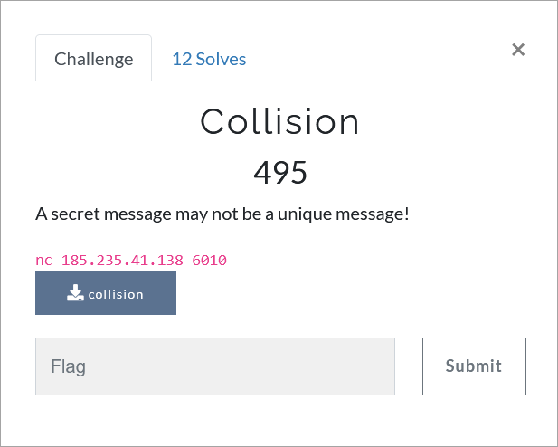

# Challenge Description
<p align="center">
  
</p>
<br>

# Writeup
In this challenge a 64-bit ELF file is given. Run the file and see that it asks us for a secret to get the flag. 
Decompile the file using Ghidra or IDA Pro. 
By analyzing the code, we find that the program receives a string from the input and then stores its words, which are separated by spaces or tabs, in an array.
It then obtains a hash value for each word using the `convert` function and stores it in a hash table. 
A closer look at the hash table implementation in the code reveals that it uses linked lists to manage collisions. 
Finally, the `find` function is called with the zero input and if its return value is more than 456, the flag is printed.
The `find` function is a simple function that, taking an index as input, returns the number of elements stored in that index of the hash table.  
So it is clear that, in order to get the flag, we need to enter a string of which at least 456 words have a hash value equal to zero.
In other words, we need to find 456 collisions for zero in the hash algorithm.  
The `convert` function that performs the hash operation in this program is decompiled as follows in IDA Pro:
```c
__int64 __fastcall convert(const char *a1)
{
  int v2; // [rsp+10h] [rbp-10h]
  int i; // [rsp+14h] [rbp-Ch]
  __int64 v4; // [rsp+18h] [rbp-8h]

  v2 = strlen(a1);
  v4 = *a1;
  for ( i = 1; i < v2; ++i )
    v4 = (a1[i] + 31 * v4) % 10000000;
  return v4;
}
```
By analyzing the `convert` function, we may come up with different ways to find the collisions in it.
But the point is that this function is actually the default function of the Java language for getting hash from strings.
There is a good tool, called ACsploit, that can be used to find collisions in hashing algorithms of some programming languages, including Java.
To introduce this tool, here we use it to find the collisions. This tool can be downloaded from the following link:  
[https://github.com/twosixlabs/acsploit](https://github.com/twosixlabs/acsploit).  
Run ACsploit by executing the following command:
```
python3 acsploit.py
```
Then to get 456 collisions for the number zero in the Java language hashing algorithm, just run the following commands in the ACsploit environment:
```
use hashes/collisions/java
set exploit.n_collisions 456
set exploit.hash_table_size 10000000
set exploit.target_type image
set exploit.target 0
set output file
set output.filename message.txt
run
```  
We send the found collisions to the program in the form of a message and receive the flag.

The flag:
```
TMUCTF{4v01d1n6_c0ll1510n5_1n_h45h1n6_4l60r17hm5_15_r34lly_h4rd!!!}
```
