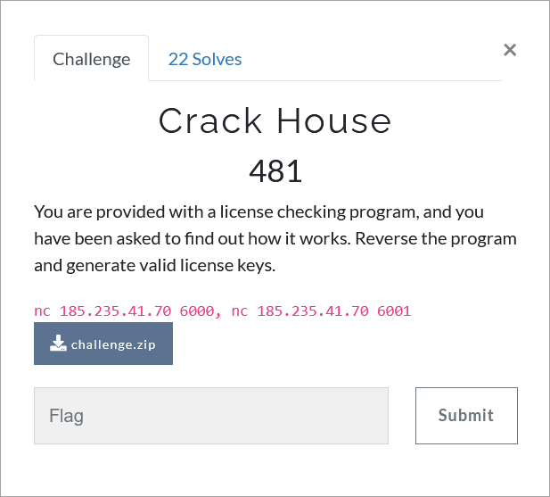

# Challenge Description
<p align="center">
  
</p>
<br>

# Writeup
First you need to open the program using DotNetSpy (dnSpy) so you can read the code.
If you read and understand the code carefully you will be able to write a script to connect to the server and get the flag. Here is the script I wrote using pwntools:
```python
import os
from pwn import *

FLAG_LEN = 16


def get_licence_key(username):
    licence_key = ''
    for i in range(FLAG_LEN):
        if i % 2 == 0:
            num = i
        elif i % 3 == 0:
            num = i + 1
        elif i % 5 == 0:
            num = i - 2
        elif i % 7 == 0:
            num = i - 5
        elif i % 11 == 0:
            num = i - 10
        elif i % 13 == 0:
            num = i + 1
        elif i % 2 == 1:
            num = i + 3
        licence_key = licence_key + chr(ord(username[i]) + num)
    return licence_key


usernames = []
licence_keys = []

seed = 'AAAAAAAAAAAAAAA'
for i in range(65, 78):
    current_username = chr(i) + seed
    usernames.append(current_username)
    licence_keys.append(get_licence_key(current_username))

seed = 'AAAAAAAAAAAAA'
for i in range(66, 78):
    current_username = 'AA' + chr(i) + seed
    usernames.append(current_username)
    licence_keys.append(get_licence_key(current_username))

conn = remote('185.235.41.70', 6000)

for i in range(len(usernames)):
    print(conn.recvuntil(b':').decode())
    conn.sendline(usernames[i].encode())
    print(usernames[i], end='')
    print(conn.recvuntil(b':').decode())
    conn.sendline(licence_keys[i].encode())
    print(licence_keys[i], end='')

print(conn.recvuntil(b':').decode(), end='')
print(conn.recvline().decode())
print(conn.recvline().decode())
```  
The flag is:
```
TMUCTF{W0w_Y0u_Cr4ck3d_7h3_H0u53_L1k3_4_Ch4mp}
```
