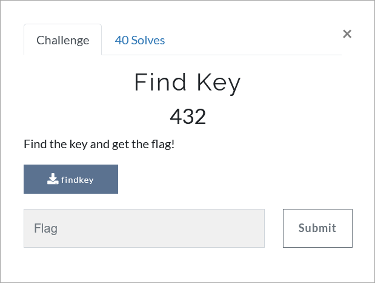

# Challenge Description
<p align="center">
  
</p>
<br>

# Writeup
In this challenge a 64-bit ELF file is given. Open the file with Ghidra or IDA Pro.
considering the type of the calculations that exist in the program, it seems that the best way to solve this challenge is to perform a symbolic execution using Angr.
The solution code for this challenge is available in [solve.py](https://github.com/TMUCTF/TMUCTF-2021/blob/main/Reversing/Find%20Key/Writeup%20Files/solve.py).

The flag:
```
TMUCTF{R3v_3n9_By_4N9r!}
```
