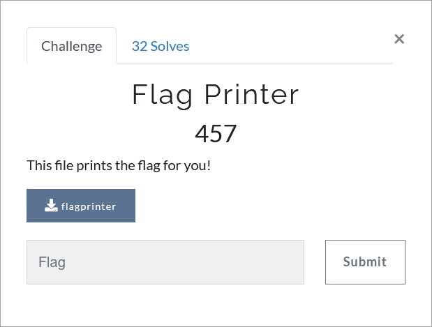

# Challenge Description
<p align="center">
  
</p>
<br>

# Writeup
We are given a binary file. If we run it, we will see that it prints flag characters. But the time intervals increase for each character and we can not just wait for it!
So decompile it to see what is happening.  
After decompilation, we see there is a `sleep` call in the `main` function and it may result in those time gaps.
We may try to patch this `sleep` function and run it again. But we see the problem is not solved and again there are some time intervals between printing each character.   
So we need to explore deeper in reversed code. There is a loop which calls the `FUN_00101189` function in it's second line:   
```c
while (local_2c < 0x26) {
    uVar1 = *(undefined4 *)(&DAT_00104020 + (long)local_2c * 4);
    bVar2 = FUN_00101189();
    sleep(local_2c * 2);
    putchar((int)(char)((((byte)uVar1 ^ bVar2) - (char)local_2c) + '&'));
    putchar(10);
    local_2c = local_2c + 1;
}
```   
Let's look at this function's definition:   
```c
ulong FUN_00101189(int iParm1)

{
  int iVar1;
  int iVar2;
  ulong uVar3;
  uint local_20;
  uint local_1c;
  
  if (iParm1 == 0) {
    uVar3 = 0;
  }
  else {
    if (iParm1 == 1) {
      uVar3 = 10;
    }
    else {
      local_20 = 0;
      local_1c = 1;
      while ((int)local_1c < iParm1) {
        local_20 = (int)((local_1c ^ local_20) + iParm1) % 10;
        local_1c = local_1c + 1;
      }
      iVar1 = FUN_00101189((ulong)(iParm1 - 1));
      iVar2 = FUN_00101189((ulong)(iParm1 - 2));
      uVar3 = (ulong)(uint)((int)(iVar1 * local_20 + iVar2 * local_20 + iParm1) % 1000000);
    }
  }
  return uVar3;
}
```  
We can see that this function has called itself two times and this is exactly the main cause of time intervals between printing each character.
Read the code and implement it using Dynamic Programming. Here is the implementation:   
```python
FLAG_LEN = 38
dylist = []


def listInitial():
    k = 10;
    dylist.append(k^k)
    dylist.append(k)
    k = 0
    for counter in range(2, FLAG_LEN * FLAG_LEN):
        k = 0
        for i in range(1, counter):
            k = ((i ^ k) + counter) % 10
        element = (dylist[counter-1]*k + dylist[counter-2]*k + counter) % 1000000
        dylist.append(element)


def process2(iParm1):
    return dylist[iParm1]


listInitial()

inputList = [46,34,2435,773649,747026,654624,127,515107,201586,69,660965,80261,607002,178,166,889499,583113,307642,909673,103016,773973,443791,196913,453766,408037,798831,704,755,494365,148287,860212,1000,202209,794979,1269,126005,14134,1317]
counter = 0
while (counter < FLAG_LEN):
    bVar1 = inputList[counter];
    bVar2 = process2(counter*counter);
    print(chr((bVar2 ^ bVar1) + (FLAG_LEN - counter)), end="");
    counter = counter + 1;
```  
The flag:  
```
TMUCTF{7h15_l4zy_f1l3_5l33p5_700_much}
```
