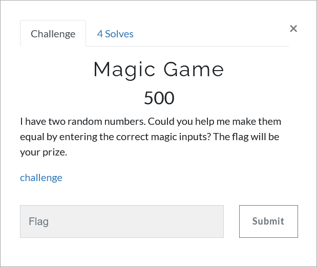

# Challenge Description
<p align="center">
  
</p>
<br>

# Writeup
In this challenge an `apk` file is given. By running this apk, we see that the app displays two numbers and asks us to equalize them by entering the magic inputs. 
Submitting magic inputs changes the given numbers. Reverse engineer the program to figure out what magic inputs we need to give it.  
After unzipping the apk file, it yields many native libraries named `*-Xamarin*` or `libmono*`.
From this, we guess that the app has been developed using `Xamarin.Android`.
Therefore, the compiled .NET code must be present somewhere within the app.
We find the magicgame.dll, throwing this file into dnSpy, refused to open it, while the files were in good shape and not encrypted.
After some Googling, we notice that the dll file is actually compressed with a custom format, which explains why dnSpy refused to open if.
The Xamarin developers had recently introduced LZ4 compression to make their APKs smaller, and the magic game application has already built with this feature.
We can decompress the dll file using the the script provided in the following link:  
[https://github.com/x41sec/tools/blob/master/Mobile/Xamarin/Xamarin_XALZ_decompress.py](https://github.com/x41sec/tools/blob/master/Mobile/Xamarin/Xamarin_XALZ_decompress.py)  
Once the original dll file has been decompressed, it can be decompiled with the dnSpy.
The source has been recovered. At this point, it should be straightforward to figure out what's going on.  
The magic input is checked to be alphanumeric and then passed to the `Conv` function and it return `lp` and `op`.  
<p align="center">
  
</p>   

In the `Conv` function, lp is the ASCII code of the first character of input, and op is the result of the `R` function on the result of the `conv2` function on the result of the `Encode` function.  
<p align="center">
  
</p>

The `R` function reverses the number and the `conv2` function converts string to hex.
The `Encode` function looks like a `Caesar Cipher` where the ASCII value of the letter determines the number of shifts of the alphabet.
The initial number of rotations is the ASCII value of the last letter of the string plus 5.
<p align="center">
  
</p>

After converting the magic input, it passed to the `chk` function and the value of the `op` variable compares with the numbers in the `Switch/Case` structure and the desired operation is performed `lp` times.
We write a script to reverse these functions and get the correct magic inputs.
```python
import binascii

def decode(string,initial):
    alph = "abcdefghijklmnopqrstuvwxyz"
    rot = initial
    decoded = ""
    for i in range(len(string)):
        c = string[i]
        plain = alph[(alph.index(c) + rot) % (len(alph) - 1)]
        decoded += plain
        rot += ord(plain) - 2
    return decoded  


def find_decoding(num):
    a = num
    num = rev(num)
    num = format(num, 'x')
    num = binascii.unhexlify(num)
    num = num.decode()
    for i in range(26):
        decoded = decode(num,i)
        if ((ord(decoded[-1]) + 5) % 25) == i:
            print("magic input equal with %d is:  %s" % (a, decode(num,i)))


def rev(num):
    a = str(num)[::-1]
    return int(a)


ops= [4932739181, 6122352081, 3611099681, 5122107891, 3550866391, 3983866391, 8920866391, 6610774871]
for op in ops:
    find_decoding(op)
```   
```
magic input equal with 4932739181 is:  upth
magic input equal with 6122352081 is:  upfi
magic input equal with 3611099681 is:  upse
magic input equal with 5122107891 is:  noop
magic input equal with 3550866391 is:  dwfi
magic input equal with 3983866391 is:  dwsi
magic input equal with 8920866391 is:  dwei
magic input equal with 6610774871 is:  swch
```  
After finding the magic inputs, we must convert the distance between the numbers to a multiple of 8 and use magic inputs to reduce the distance to zero.
This can be done in several ways, but we did this using "upth" operation and wrote a script that gives us the correct sequence of inputs.
```python
def eight(dis):
    a = int(dis / 8)
    b = int(a / 122)
    c = a % 122
    if chr(c).isalnum():
        return b, c, 0
    else:
        b=int(a / 122) - 1
        c= a - b * 122
        if chr(c).isalnum():
            return b, c, 0
        elif c % 2 == 0:
            if chr(int(c / 2)).isalnum():
                return b, int(c / 2), int(c / 2)
            else:
                return b, 100, c - 100
        else:
            if chr(int(c / 2)).isalnum():
                return b, int(c / 2), int(c / 2) + 1 
            else:
                return b, 100, c - 100


def multiples(count):
    global magicinputs
    for i in range(int(count / 8), 0, -1):
        a = count - i * 8
        if a % 3 == 0:
             if chr(int(a / 3)).isalnum():
                return chr(int(a / 3))


def swch():
    global num1, num2, magicinputs
    a = num1
    num1 = num2
    num2 = a
    magicinputs.append("1swch")


num1 =  int(input("num1: "))
num2 = int(input("num2: "))
magicinputs = []
dis = num1 - num2
if dis < 0:
    swch()
a = multiples(num1 - num2)
magicinputs.append(a + "upth")
for i in range(0, ord(a)):
    num1 -= 2
    num2 += 1
swch()
b, c, d = eight(abs(num1 - num2))
magicinputs.append(chr(c) + "dwei")
if d != 0:
    magicinputs.append(chr(d) + "dwei")
for i in range(0, b):
    magicinputs.append("zdwei")
print(magicinputs)
```   
The flag:
```
TMUCTF{D3c0mpr355_X4m4r1n_DLL5_50_7h3y_c4n_b3_d3c0mp1l3d!}
```
