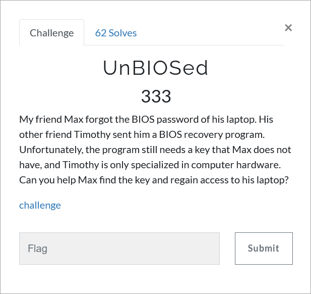

# Challenge Description
<p align="center">
  
</p>
<br>

# Writeup
As it is obvious to many, it is a simple python program packed with pyinstaller.
We have to extract it using pyinstxtractor.py to get the pyc file.
Then we need to use uncompyle6 to extract the py file but first we need to use a hex editor to fix the corrupted header.
After that it is just a matter of simple reversing and we can get the flag easily.

The flag:
```
TMUCTF{M4y_4ll_Y0ur_D3c1510n5_b3_Unb1053d!}
```
