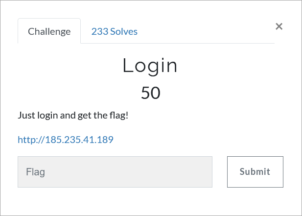

# Challenge Description
<p align="center">
  
</p>
<br>

# Writeup
The given address is a login page that asks for a password to give the flag.
<p align="center">
  
</p>

By entering a test value we get this message: "Try harder!". Usually the first thing that comes to mind in these cases is to check the `robots.txt` file.
We check this file and see that it contains a snippet of PHP code.
<p align="center">
  
</p>

This code indicates that if the password matches its MD5 hash, the login will be successful and the flag will be displayed. 
Since the comparison type used in this code is the loose comparison, we can search for the magic hashes to bypass it. 
If you are not familiar with the differences between the loose and strict comparisons in PHP, be sure to read about it.  
The following link is a good source for MD5 magic hashes:  
[https://github.com/spaze/hashes/blob/master/md5.md](https://github.com/spaze/hashes/blob/master/md5.md)

Finally we enter "0e215962017" as the password and login successfully.
<p align="center">
  
</p>

The flag:
```
TMUCTF{D0_y0u_kn0w_7h3_d1ff3r3nc3_b37w33n_L0053_c0mp4r150n_4nd_57r1c7_c0mp4r150n_1n_PHP!?}
```
