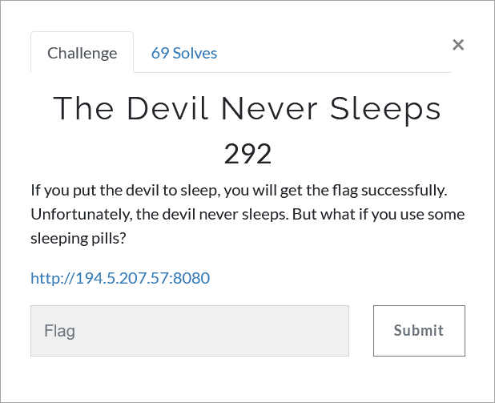

# Challenge Description
<p align="center">
  
</p>
<br>

# Writeup
It is a simple JWT challenge. If you navigate to `/flag` you can see the error "Missing Pill header". Navigating to `/sleepingpill` you see a public key and a jwt token.
The rsa public key is created using `mersenne primes` so it is vulnerable. You can use `Rsactftool` to recover the private key and using the private key you can sign
forged jwt tokens. Now all you had to do was to forge a jwt token with parameter "sleep" set to true and then send it as `Pill` header to `/flag`.

The flag:
```
TMUCTF{0h_51nn3rm4n_Wh3r3_Y0u_60nn4_Run_70?}
```
