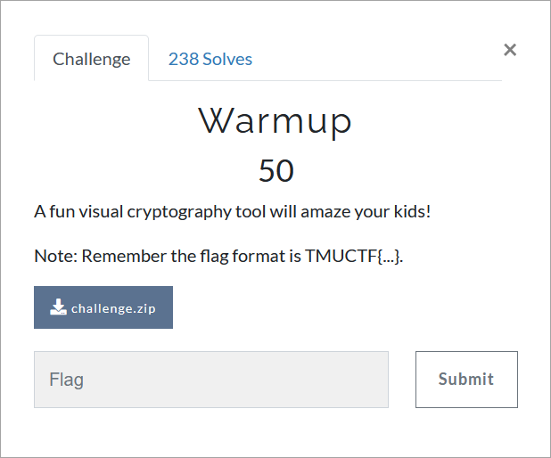

# Challenge Description
<p align="center">
  
</p>
<br>

# Writeup
In this challenge we are given two images: "secret.png" and "ciphered_message.png".
If we Google the challenge description, we will find this link: [https://github.com/ageron/visual_crypto](https://github.com/ageron/visual_crypto).
This link describes the Visual cryptography tool.
From the description provided in this link, we realize that we have to put the "secret.png" and "ciphered_message.png" images on the top of each other to get the original image.
There are several ways to do this. The easiest way is to use the online tools like this link: [https://www.imgonline.com.ua/eng/impose-picture-on-another-picture.php](https://www.imgonline.com.ua/eng/impose-picture-on-another-picture.php), which gives us [message.png](https://github.com/TMUCTF/TMUCTF-2021/blob/main/Welcome/Warmup/Writeup%20Files/message.png).

The flag:
```
TMUCTF{W3_h0p3_y0u_3nj0y_7h15_c0mp371710n_4nd_7h4nk_y0u!}
```
